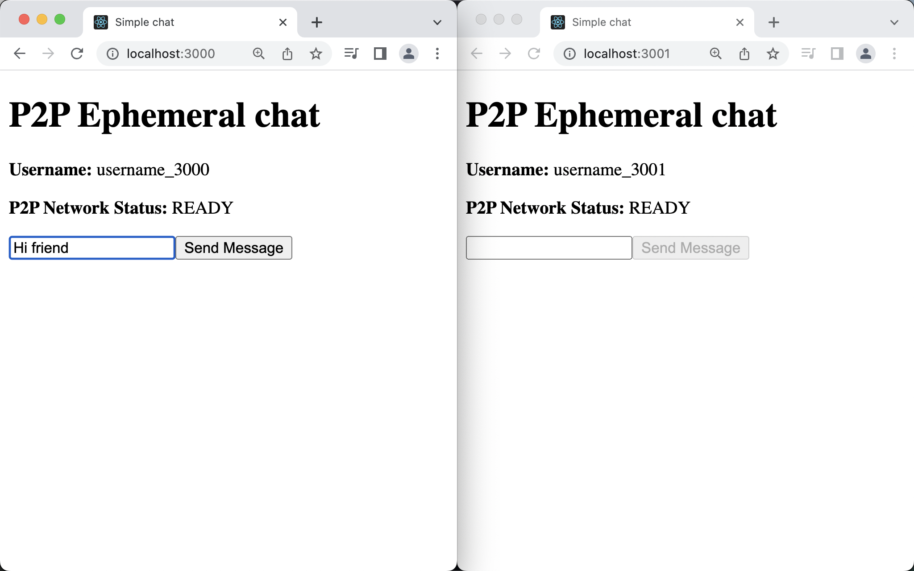
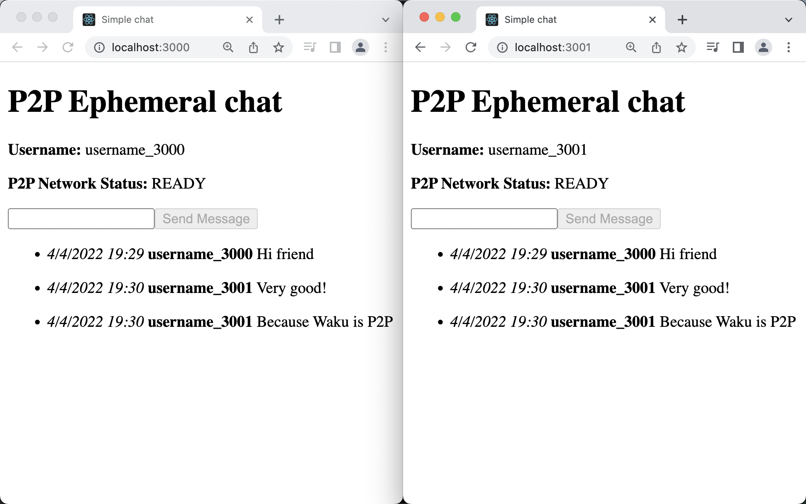

# Simple chat using Waku protocol

Elementary chat sends and receives messages from the other peers connected to the same **topic** and you who is online in real time.

## Steps to run the chat

1. Install the packages running the following command on the terminal `npm i`.
2. Open two terminals.
3. From the root of the project, run `npm start` on each of the two terminals.
4. Open two tabs on the browser:
   1. The first one opening `http://localhost:3000`
   2. The second one opening `http://localhost:3001`
5. You can chat.

## To-do

- Save messages in the local storage only during the session of the user.
- After some time (15 minutes), delete the oldest online users.

## Resources

- Waku's specifications https://rfc.vac.dev/spec/10/
- The code is an improvement of https://github.com/status-im/js-waku/blob/master/examples/relay-reactjs-chat/ (also in [Waku Connect's docs](https://docs.wakuconnect.dev/docs/guides/02_relay_receive_send_messages/)). We improve the methods for sending different kind of data (e.g. messages, online users...) in the Waku protocol.
